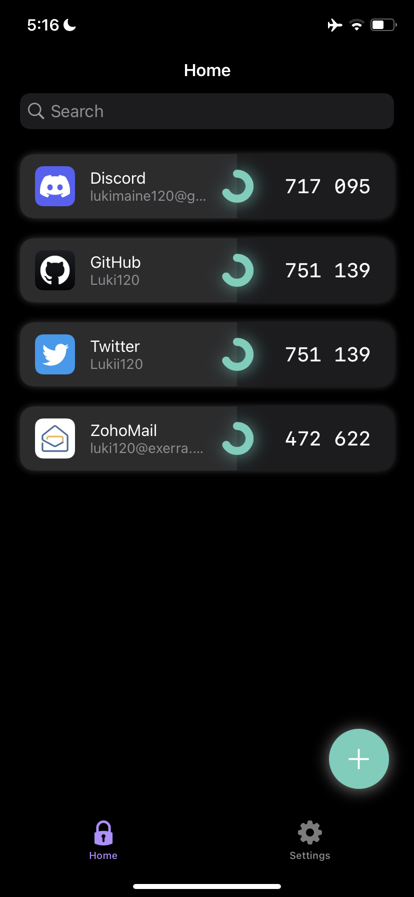

# Azure

 &nbsp; 

## Features

* App logos for most common issuers.
* Backup/import feature.
* Biometrics.
* Data gets securely stored in the Keychain.
* Editable & rearrangeable issuers.
* Manually input QR code hashes, import a QR image & scan QR codes.
* **NO** account system required.
* **NO** email required.
* **NO** phone number required.
* Pleasant, clean UIKit animations.
* Purge all data.

## Add an issuer's icon

* Clone this repository.
* Get the icon for the app that you want in the best quality you can get & compress it to 120x120px, using lossless compression if possible.
* Place it inside `/Resources/Issuers/` with an appropriate naming, using capital letters if needed to.
* Follow the contributions' etiquette to commit, push your changes & open a PR.

## Socials

* [Twitter](https://twitter.com/Lukii120)
* [Support on Discord](https://discord.gg/MPtS6WXbGq)

## Contributing

* Contributions are more than welcomed, but should follow this etiquette:

	* If you're a contributor with write access to this repository, you **should NOT** push to main branch, preferably push to a new one and *then* create the PR.
	* Keep commit titles short and then explain them in comments or preferably in the commit's description.
	* Push small commits (e.g if you changed 2 directories, commit one directory, then commit the other one and only THEN push)

## LICENSE

* [GNU General Public License 2.0](https://www.gnu.org/licenses/old-licenses/gpl-2.0.html)

## Assets LICENSE

* Under no means shall the visual assets of this repository – i.e., all photo-, picto-, icono-, and videographic material – (if any) be altered and/or redistributed for any independent commercial or non-commercial intent beyond its original function in this project. Permissible usage of such content is restricted solely to its express application in this repository and any forks that retain the material in its original, unaltered form only.
